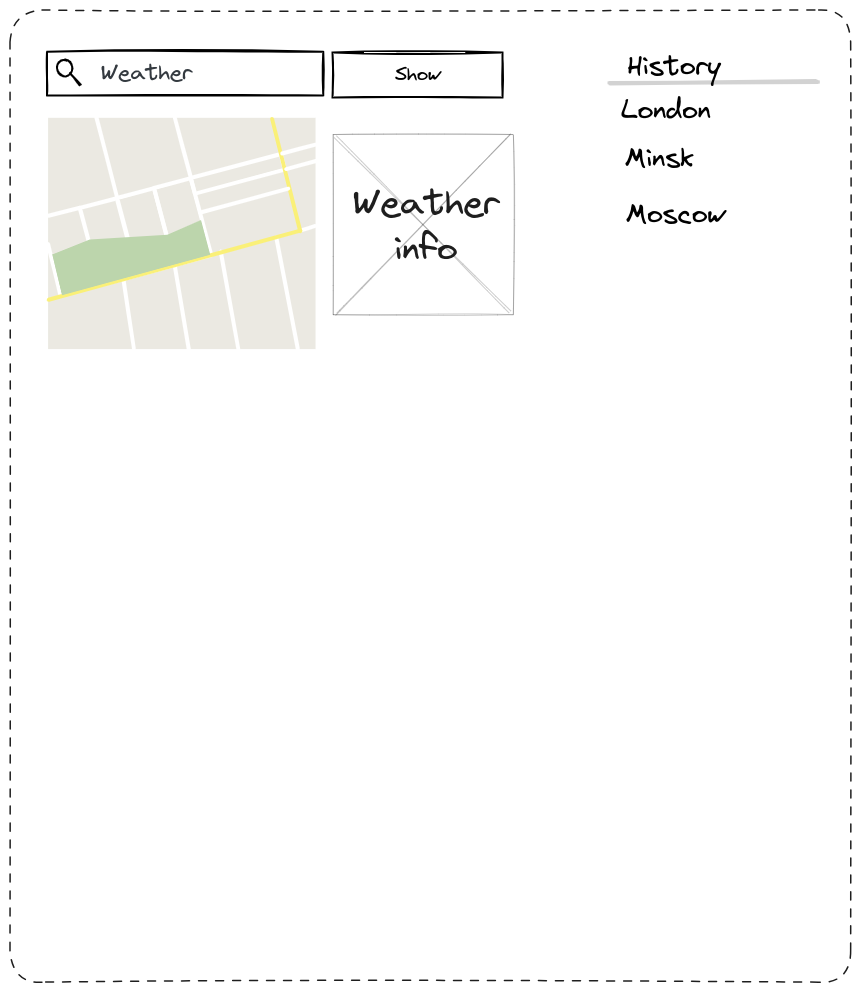

# Приложение "Прогноз погоды"

1.1 при открытии страницы пользователь видит погоду (город, температуру и иконку) в своей местности (для получения прогноза погоды используется Open Weather Map API)
1.2 пользователь может ввести имя города в поле ввода и увидеть погоду в выбранном городе
1.3 введенные города сохраняются у пользователя в браузере, так что он видит последние 10 городов, где он смотрел погоду
1.4 при клике по строчке города в списке он видит погоду в выбранном городе
1.5 кроме информации о погоде в центре страницы показывается карта для введенного адреса (используется Google Maps Static API)

Покрытие кода тестами не ниже 60%

## Описание, устанавливаемых фреймворков

### [Инициализация проекта](docs/init.md)

### [Установка пакетов](docs/install.md)

### [Тестирование](docs/test.md)

### [Поиск ошибок в коде](docs/linter.md)

### [Унификация стиля кода](docs/prettier.md)

### [Фильтрация кода перед git commit](docs/stage.md)

### [CI/CD](docs/deploy.md)

### [Webpack](docs/webpack.md)

### [Веб-сервер](docs/web_server.md)